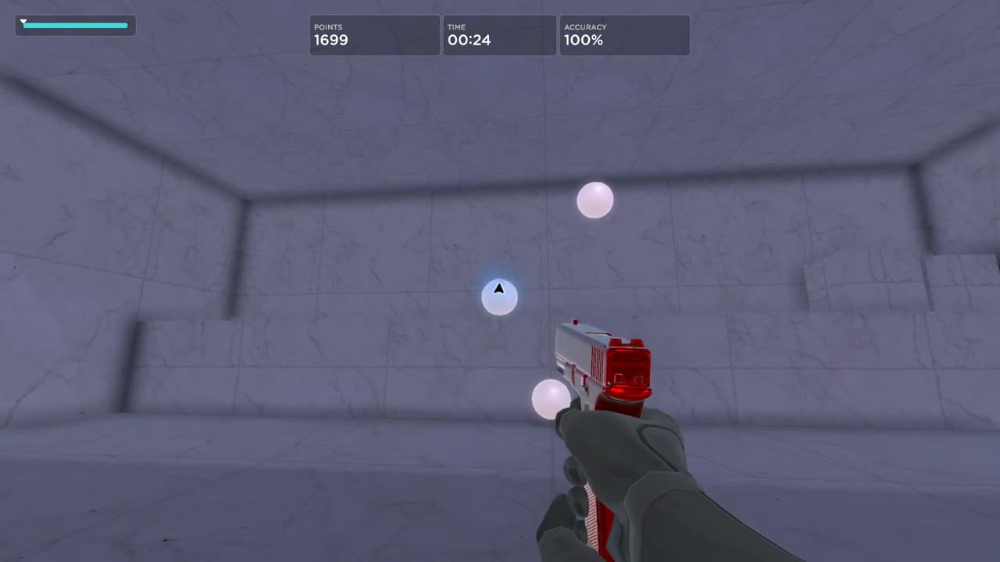
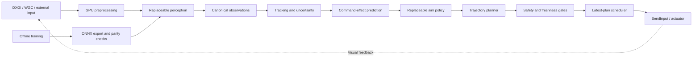

# OpenPrism

**A modular, trainable visual perception and control research framework for Windows.**

OpenPrism turns fresh visual observations into tracked targets, predictions and bounded control commands. Its C++20 runtime is designed for low latency; Python handles offline training, export and evaluation. Aimlabs is the first controlled benchmark, while the reusable core accepts replaceable inputs, detectors and decision policies.

## Demo

[](https://github.com/lottooss/OpenPrism/raw/refs/heads/main/media/demo.mp4)

[Watch the real Aimlabs test recording](media/demo.mp4): **16 hits / 16 shots**, score **3,024** in this single run. Playback is normal speed. See [demo notes](media/README.md) for the test conditions and limitations.

## What makes it modular

| Replaceable component | Responsibility |
|---|---|
| Input / capture | DXGI capture, WGC fallback, or external canonical observations |
| Perception / shape detector | Convert image tensors into target observations; TensorRT deployment for compatible exported models |
| Tracking | Associate observations and estimate target state and uncertainty |
| Prediction | Extrapolate target state to measured command-effect time |
| Decision maker | Select a target and decide whether movement or a shot is justified |
| Trajectory planner | Convert aim error into bounded smooth movement |
| Calibration and actuation | Map pixels to device counts and dispatch through a guarded actuator |

Versioned FlatBuffers messages keep the detector independent of tracking and policy. Native C++ interfaces and a versioned C ABI define extension boundaries. Replacing a module requires implementing its contract and validating timing, coordinates and safety; it does not require rewriting the whole pipeline.

## Architecture



The production hot path uses bounded, latest-message-wins transport and preallocated storage. Training, recording, disk access and dashboards stay outside it. See [architecture details](docs/ARCHITECTURE.md), [bus contracts](docs/bus_contract.md), [plugin contracts](docs/plugin_contract.md) and [scenario contracts](docs/scenario_contract.md).

## Trainability

Perception can be retrained offline with new annotated examples, exported through ONNX and validated for TensorRT. Separate policy tooling supports imitation-learning experiments; the default native controller uses a deterministic utility policy. Running the application does **not** automatically train it. The custom center-heatmap detector is an alternative research implementation, not the detector used in the recorded demo. See [training and evaluation](docs/TRAINING.md).

## Performance and current status

The design targets **6 ms p99 from capture-surface arrival to command dispatch**, with a **10 ms hard stale-data cutoff** and a **1,000 Hz latest-plan scheduler**. These are different quantities: scheduler frequency is not inference FPS, and the latency target is not a measured photon-to-photon guarantee.

A local TensorRT FP32 inference-only benchmark on an RTX 4060 Laptop GPU measured **1.378 / 3.439 / 3.795 ms p50 / p95 / p99** (50 warmup iterations, 160 samples, maximum 3.820 ms). This is a single-stage result; concurrent game workload was not recorded for that benchmark. The full concurrent latency target and sustained accuracy remain to be established.

The system has completed real closed-loop Aimlabs runs, but target acquisition remains slow in the current research configuration. The demo is evidence of operation, not competitive performance or generalization. Strict whole-tensor PyTorch-to-ONNX parity remains unresolved for the local reference artifact, although its separate TensorRT center/confidence checks passed. Model weights, engines, datasets and machine-specific calibration are not distributed here.

## Build and test

Use Windows x64, Visual Studio 2022 C++ tools, CMake 3.25+, Ninja and vcpkg. Run in an x64 developer shell and set `VCPKG_ROOT` to your vcpkg installation. Dependency versions are pinned by the manifests and lockfile.

```powershell
cmake --preset windows-msvc-debug
cmake --build --preset windows-msvc-debug
ctest --preset windows-msvc-debug --output-on-failure
cmake --preset windows-msvc-release
cmake --build --preset windows-msvc-release
```

For Python tooling, install Python 3.12 and uv:

```powershell
uv sync --frozen --project python
uv run --project python pytest
uv run --project python ruff check tools tests
uv run --project python mypy --strict tools
```

Core tests do not require distributing a model or proprietary SDK. Live TensorRT operation additionally requires compatible NVIDIA CUDA/TensorRT installations, an independently obtained and validated model engine, a scenario configuration and local calibration. See [running locally](docs/USAGE.md). This repository is a source distribution, not a preconfigured download-and-play package.

## Safety and scope

Use only in controlled environments where you are authorized to automate input. Focus, source freshness, calibration, uncertainty, movement bounds and emergency-stop checks fail closed. F11 arms the launcher; F12 or Escape stops input. There is no process injection, game-memory inspection or anti-cheat bypass. OpenPrism is independent of and not affiliated with Aimlabs.

## License

Project-owned source is **source-available for noncommercial use** under [PolyForm Noncommercial 1.0.0](LICENSE). Commercial use, resale and monetization require separate permission. This is not an OSI open-source license. Preserve [NOTICE](NOTICE); third-party dependencies and model artifacts retain their [own licenses](LICENSES/THIRD_PARTY.md), including Ultralytics licensing where applicable.
